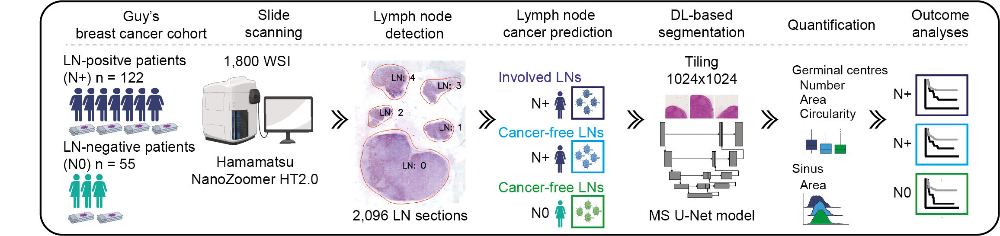

# smuLymphNet




This repository contains trained deep learning models to detect and quantify immune morphometric (1. Germinal centres 2. sinuses) features in lymph nodes using a multiscale fully convolutional networks trained on breast cancer patients from Guy's hospital.

In order to use the scripts present in this repository, make sure that you are working in a python environment that satisfies the requirements of
`requirement.txt`.

## Pipeline summary 

1. Trained germinal centre and sinus segmentation PyTorch models
2. Inference pipeline: generates entire WSI segmentation mask
3. Quantification pipeline:


## 1. Models

The trained pytorch models for germinal centre and sinus segmentation at 10x magnification are under the ./models folder.

1. gc_multi.pth: germinal centre segmentation
2. sinus_multi.pth: sinus segmentation

## 2. Inference

Performs segmentation at 10x magnification using trained multiscale U-Net germinal centre and sinus models. Base magnification level of WSIs should be set. Ideally needs a single GPU for inference. Can perform segmentation of each model individually by not setting the path to either one or perfom combined segmentation by setting both paths.

Example usage

```python
python ./src/inference.py -wp /folder/with/wsi -sp /output_folder/ -gm /models/gc_multi.pth -sm /models/sinus_multi.pth
```

Arguments as follows.

* `wp`: `str`, the path to the folder containing original WSI (or of a single WSI).
* `sp` :`str`, path to folder to save down segmentation masks.
* `gm`: `str` path of trained pytorch germinal multiscale model
* `sm`: `str` path of trained pytorch sinus multiscale model
* `gt`: `float` threshold for germinal prediction
* `st`: `float` threshold for sinus prediction
* `bl`: `int` base magnification level
* `td`: `int` tile dimensions
* `ss`: `int` stride 
* `ds`: `int` downsample

Default arguments, stride, thresholds and tile size can be experimented with for best results. Produces WSI segmentation mask and thumbnail of slides in output directory. 

## 3. Quantification

Once the segmentation masks have been generated, we can quantify the segmented features. Example usage

```python
python ./src/quantify.py -wp /folder/with/wsi -mp /folder/with/segmentation_masks -sp /folder/to_save_output
```
 
Arguments are:

* `wp`: `str`, the path to the folder containing original WSI (or of a single WSI).
* `mp` : `str`, the path to the folder containng the segmentation masks.
* `sp`: `str` the path to save outputs

This produces a csv file with quantification number, size and shape of gcs and total sinuses area normalised by the lymph node area.

## Credits

The pipeline was written by the [Cancer Bioinformatics][url_cb] group at [King's College London][url_kcl], UK and the MeDAL lab at ITT Bombay

Development and implementation by [Gregory Verghese](gregory.e.verghese@kcl.ac.uk), [Mengyuan Li](mengyuan.3.li@@kcl.ac.uk), [Nikhil Cherian](nikhilcherian30@gmail.com). 

Study concept and design [Gregory Verghese](gregory.verghese.@kcl.ac.uk), [Mengyuan Li](mengyuan.3.li@@kcl.ac.uk) and [Anita Grigoriadis](anita.grigoriadis@kcl.ac.uk).

[url_cb]: http://cancerbioinformatics.co.uk/
[url_kcl]: https://www.kcl.ac.uk/

